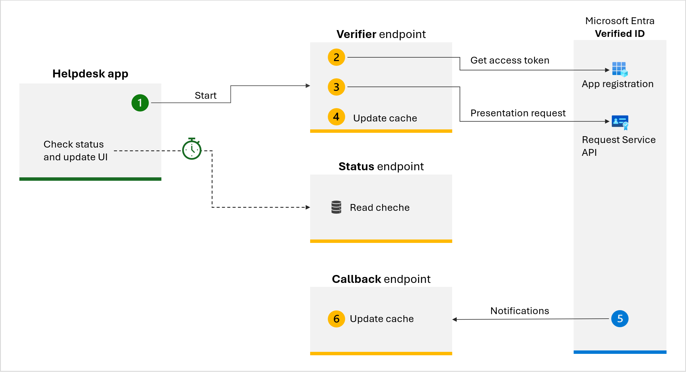

# Helpdesk prove request

The diagram below outlines the components and the flow of a presentation request



## Verifier endpoint

The verifier endpoint initiates a presentation request when helpdesk staff ask an employee to verify their identity.

- **Step 1.** To initiate the verification process, a helpdesk personnel enters the user's UPN and phone number (to which the notification will be sent). A JavaScript code then calls the [Verifier endpoint](./Controllers/VerifierController.cs). Use the following JSON payload to call the verifier endpoint from the frontend app:
    
    ```json
    {
        "upn": "10@sample.com",
        "phone": ""
    }
    ```

- **Step 2.** Preperation
  - **Step 2.1** Conducts several input validations, such as verifying the validity of the UPN.
  
  - **Step 2.2** Acquires an access token utilizing the client credentials flow through an application registration in Microsoft Entra ID (with the respective permissions).

  - **Step 2.3**  Generates a JSON payload like the one below. The payload includes the `request.Callback.State` with a generated unique identifier. This ID is crucial for correlating the callback event with the state included in the original payload and it's used as the key for the Azure Blob table object. 

- **Step 3.** Call to the **Request Service REST API**. 
  - **Step 3.1** With both the JSON payload and access token ready, it subsequently starts an HTTP POST request to the Microsoft Entra verified ID *Request Service REST API*. Here is an example of the JSON payload:

    ```json
    {
        "authority": "did:web:did.woodgrove.com",
        "includeQRCode": false,
        "registration": {
            "clientName": "Woodgrove helpdesk",
            "purpose": "Prove your identity"
        },
        "callback": {
            "url": "https://woodgrove.com/api/verifier/presentationcallback",
            "state": "11111111-0000-0000-0000-000000000000",
            "headers": {
                "api-key": "<API key to help protect your callback API>"
            }
        },
        "includeReceipt": false,
        "requestedCredentials": [
            {
                "type": "VerifiedEmployee",
                "acceptedIssuers": [
                    "did:web:did.woodgrove.com"
                ],
                "configuration": {
                    "validation": {
                        "allowRevoked": false,
                        "validateLinkedDomain": true
                    }
                },
                "constraints": [
                    {
                        "claimName": "revocationId",
                        "values": [
                            "10@sample.com"
                        ]
                    }
                ]
            }
        ]
    }
    ```

  - **Step 3.2** If the **Request Service REST API** call is successful, it returns a response code (HTTP 201 Created), and a collection of event objects in the response body.The `url` is that launches the authenticator app and starts the presentation process. Applications can present this URL through a web hyperlink, QR code, or push notification. The following JSON demonstrates a successful response:

    ```json
    {
        "requestId": "e4ef27ca-eb8c-4b63-823b-3b95140eac11",
        "url": "openid-vc://?request_uri=https://verifiedid.did.msidentity.com/v1.0/00001111-aaaa-2222-bbbb-3333cccc4444/verifiableCredentials/presentationRequests/e4ef27ca-eb8c-4b63-823b-3b95140eac11",
        "expiry": 1633017751
    }
    ```
    
 - **Step 4.** The **verifier endpoint** uses Azure Blob table to keep state about the request. The key is the state value from the `request.Callback.State` attribute in the request. The UI will check the state when calling the [status endpoint](./Controllers/RequestStatusController.cs). Finally, the **verifier endpoint** returns the status to the frontend application. Then the frontend application uses this data to update the user interface. The following JSON shows an example.
    
    ```json
    {
        ...
        "RowKey": "yoel@woodgrovecorp.onmicrosoft.com",
        "Timestamp": "2025-04-20T07:39:39.8996443Z",
        "message": "Waiting for the user to open the notification.",
        "status": "request_created",
        "url": "openid-vc://?request_uri=https://verifiedid.did.msidentity.com/v1.0/00001111-aaaa-2222-bbbb-3333cccc4444/verifiableCredentials/presentationRequests/e4ef27ca-eb8c-4b63-823b-3b95140eac11"
    }
    ```

## Callback endpoint

- **Step 5.** The callback endpoint is called (by Microsoft Entra verifeid ID service) when a user scans the QR code, uses the deep link to the Authenticator app, or finishes the presentation process. The payload contains information like the `state` value that you passed in the original payload (we use it as a key for Azure Blob table), `requestStatus`, `claims` and more. 


- **Step 6.** The callback endpoint executes the logic"

  - **Step 6.1** check the value of the `requestStatus` and creates a user freindly message
  - **Step 6.2** Updates the Azure Blob table with the latest status and the freindly message, so the UI can check the state when calling the [Status endpoint](./Controllers/RequestStatusController.cs).
    

The following JSON shows an example of **request_retrieved** status to the callback endpoint

```json
{
    "requestId": "12345678-1234-1234-1234-000000000000",
    "requestStatus": "request_retrieved",
    "state": "11111111-0000-0000-0000-000000000000"
}
```


The following JSON shows an example of **presentation_verified** status to the callback endpoint
```json
{
    "requestId": "12345678-1234-1234-1234-000000000000",
    "requestStatus": "presentation_verified",
    "state": "11111111-0000-0000-0000-000000000000",
    "verifiedCredentialsData": [
        {
            "issuer": "did:web:did.woodgrove.com",
            "type": [
                "VerifiableCredential",
                "VerifiedEmployee"
            ],
            "claims": {
                "displayName": "Test user",
                "preferredLanguage": "en-US",
                "revocationId": "10@sample.com",
                "photo": "iVBORw0KGBCZr8J8yiLFAtu4JHpJ...."
            },
            "credentialState": {
                "revocationStatus": "VALID"
            },
            "domainValidation": {
                "url": "https://did.woodgrove.com/"
            },
            "expirationDate": "2025-09-15T11:29:12.000Z",
            "issuanceDate": "2025-03-19T11:29:12.000Z"
        }
    ],
    "subject": "did:ion:EiBxCxgghGgBvNEVi9E...."
}
```
    
## Status endpoint

The frontend application queries the "status" endpoint every three seconds to obtain the latest updates regarding user activity using the user's principal name. The endpoint retrieves the status data from the Azure Blob table and return it to the application. Consequently, the application updates the user interface in accordance with this information. When the status is `presentation_verified`, the application should stop the three-second interval.

The JSON below illustrates the payload required to call the status endpoint:

```json
{
    "state": "10@sample.com""
}
```

The response is similar to the one returned verifier endpoint

```json
{
    ...
    "RowKey": "yoel@woodgrovecorp.onmicrosoft.com",
    "Timestamp": "2025-04-20T07:41:30.8996443Z",
    "message": "The user has successfully completed their verification process.",
    "status": "presentation_verified"
}
```

## Parameters

- **ApiKey** a secret used by the API
- **CallbackUrl** - This is your Logic App callback workflow. The URL must be simple for Entra ID to call it. We use Azure API management service with URL [rewrite to remove extra query string parameters](./Azure-API-Management/APIM-policy.xml) and simplify the URL.

- **TenantId** - Your Microsoft Entra tenant ID.
- **ClientId** - The application ID you registered for the verified ID.
- **ClientSecret** - The application secretn created.
- **Scope** - Use this `3db474b9-6a0c-4840-96ac-1fceb342124f/.default` value.
- **DidAuthority** - The DID identifier of your verified ID (from [Entra admin center](https://entra.microsoft.com))

## API Connections

The `azuretables` API Connections enable the reading and writing of entities within the Azure Blob table. 
